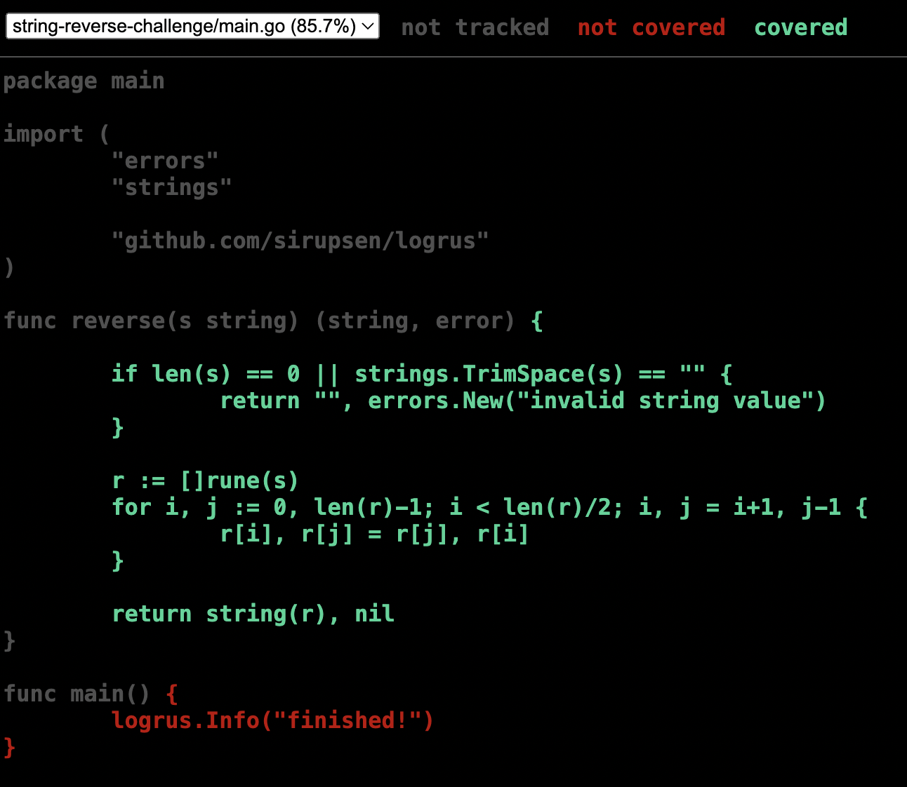

# String Reverse Challenge Solution

## Challenge
 `Write a golang function to reverse a string.` The complete challenge with the restrictions and requirements can be found [here](https://github.com/juanpablopizarro/code-challenge-template/blob/main/examples/01-string-reverse-challenge.md)

 ## Solution
You can implement different solutions. The one I choose was:

```go
func reverse(s string) (string, error) {

	if len(s) == 0 || strings.TrimSpace(s) == "" {
		return "", errors.New("invalid string value")
	}

	r := []rune(s)
	for i, j := 0, len(r)-1; i < len(r)/2; i, j = i+1, j-1 {
		r[i], r[j] = r[j], r[i]
	}

	return string(r), nil
}
```

The function reverse takes a string and return the reversed string and an error. The error is different from `nil` when the string is empty and I took the empty definition as *"a 0 length string or a just spaces string"*.

## Compile and run
We can use the regular go build and run as follow:

```
go run main.go
go build -o string-reverse-challenge main.go
./string-reverse-challenge
```

## Test
In order to run the tests and see a minimal information about the results we can run `go test ./...`. This retrieves something similar to:

```console
$ go test -count=1 ./...
ok      string-reverse-challenge        0.609s
```

The `-count=1` forces to skip the go test cache.

To add more information we can run `go test -cover -count=1 ./...` an obtain:

```console
$ go test -cover -count=1 ./...
ok      string-reverse-challenge        0.658s  coverage: 85.7% of statements
```
And as you can see we arrived to the coverage but there is a extra step to see the missing lines of it and it is:

```console
$ go test -coverprofile=test.out -count=1 ./...
```
That command runs the go test and create a coverage report into test.out. We can see as `html` the content of that report using:

```console
$ go tool cover -html=./test.out
```

And we can see a report like:



So there you can see in red which lines we are missing.

The test itself is a table driven testing that tests the happy path and the edge cases:

```golang
func TestReverse(t *testing.T) {
	tests := []struct {
		input    string
		expected string
		err      bool
	}{
		{"Hello World", "dlroW olleH", false},
		{"123456", "654321", false},
		{"A", "A", false},
		{"", "", true},
		{"  ", "", true},
	}

	for _, test := range tests {
		actual, err := reverse(test.input)
		assert := assert.New(t)

		assert.Equal(test.err == true, err != nil, fmt.Sprintf("we expect an error with input = %q", test.input))
		assert.Equal(test.err == false, err == nil, fmt.Sprintf("we do not expect an error with input = %q", test.input))
		assert.Equal(actual, test.expected, fmt.Sprintf("reverse(%q) = %q but expected %q", test.input, actual, test.expected))
	}
}
```

## CI/CD
To solve the CI/CD I used [github actions](https://docs.docker.com/build/ci/github-actions/). The github action content is:

```yaml
name: ci
on:
  push:
    tags:
      - 'v*'
jobs:
  docker:
    runs-on: ubuntu-latest
    steps:
      -
        name: Checkout
        uses: actions/checkout@v3
      -
        name: Docker meta
        id: meta
        uses: docker/metadata-action@v4
        with:
          images: |
            jppizarro/string-reverse-challenge
          tags: |
            type=semver,pattern={{version}}.{{major}}.{{minor}}
      -
        name: Login to DockerHub
        if: github.event_name != 'pull_request'
        uses: docker/login-action@v2
        with:
          username: ${{ secrets.DOCKER_USERNAME }}
          password: ${{ secrets.DOCKER_TOKEN }}
      -
        name: Build and push
        uses: docker/build-push-action@v4
        with:
          context: .
          push: ${{ github.event_name != 'pull_request' }}
          tags: ${{ steps.meta.outputs.tags }}
          labels: ${{ steps.meta.outputs.labels }}

```


